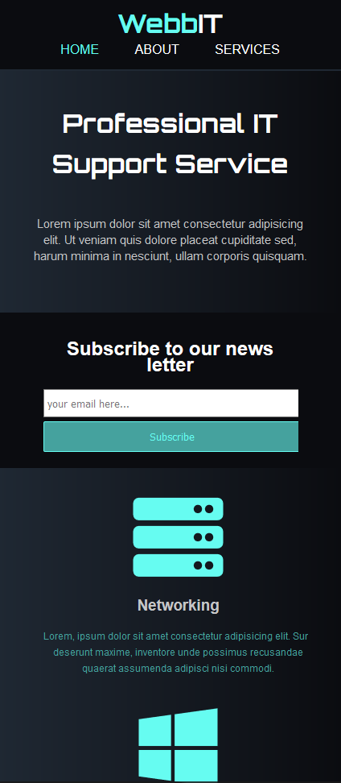

# Responsive-web-layout-01
- This repository contains mobile friendly HTML5 website for a fictional IT  support company
- This website has three pages; Home page, About page and a Services page.
- Simple striking color theme
- HTML sematic tags, and basic HTML and CSS

## Folders and Files
- index.html file as the entry point
- about.html file as the about page
- services.html file as the services page
- css folder contains styles sheet
- img folder contains banner image and screenshot images

## Links
[See website here!](https://dulanjaleefl.github.io/Responsive-web-layout-01/)

## Build with
- HTML
- CSS

## Screenshots

